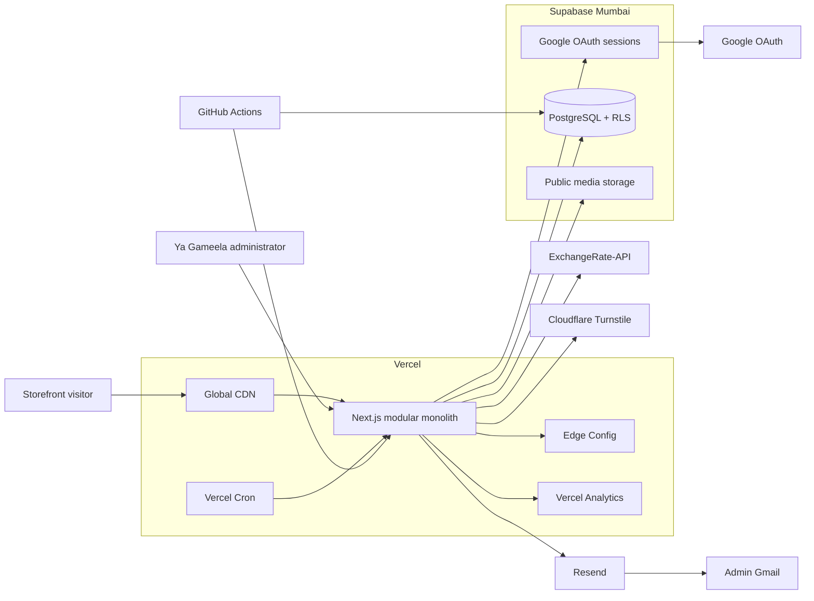
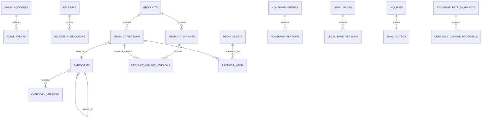
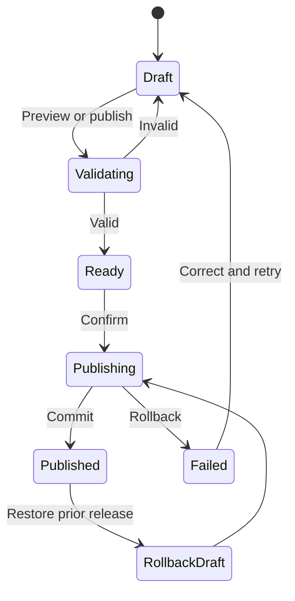
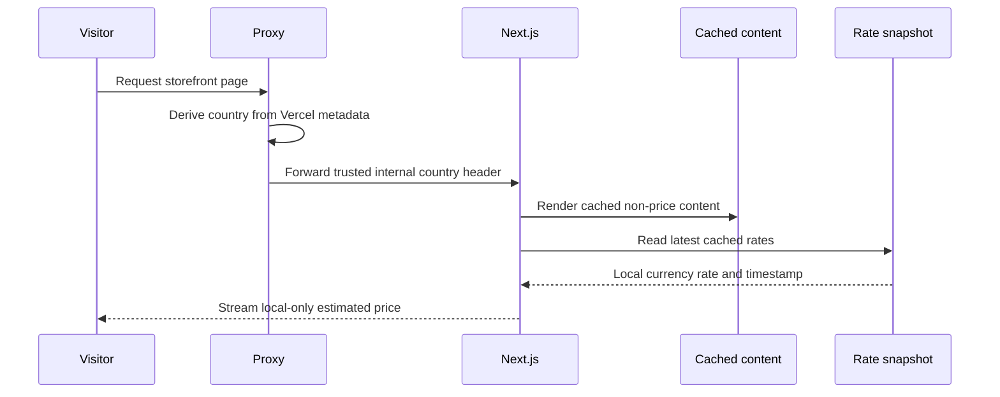
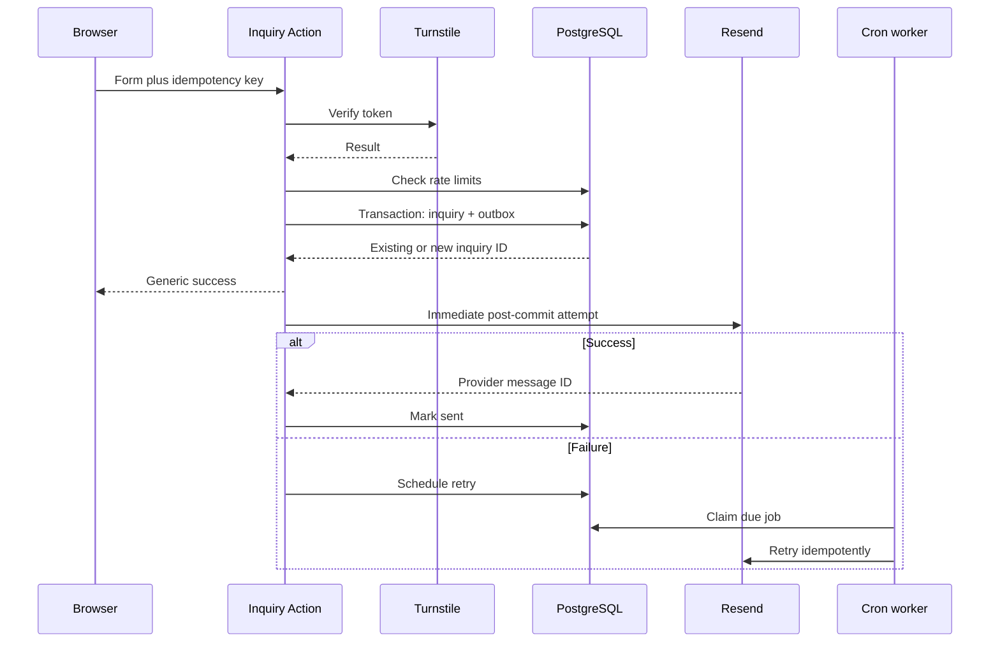

# Ya Gameela V1 Architecture

| Field | Value |
| --- | --- |
| Status | Approved target architecture |
| Product scope | V1 marketing catalog and custom CMS |
| Requirements | [`PRD.md`](./PRD.md) |
| Style | Modular monolith |
| Runtime | Next.js 16 on Node.js 24 LTS |
| Production data region | Mumbai |

## 1. Purpose and Principles

This document defines how Ya Gameela V1 will be implemented. It covers the public storefront, protected CMS, data model, publishing, integrations, security, caching, operations, failure handling, and testing.

The architecture follows these rules:

1. **Server first.** React Server Components render by default. Client Components exist only for browser interaction.
2. **One secure data boundary.** All application data access passes through a server-only Data Access Layer (DAL).
3. **Database-enforced invariants.** RLS, constraints, and transactional PostgreSQL functions protect critical operations.
4. **Published content is immutable.** Editing creates drafts; publishing moves stable entity pointers to validated versions.
5. **External side effects are recoverable.** Email and cache invalidation use durable outbox records and idempotent workers.
6. **Personal data is minimized.** PII is excluded from logs, analytics, audit payloads, URLs, and email subjects.
7. **Caching is explicit.** Public content is tagged and cached; admin, preview, filters, and visitor-specific prices remain dynamic.
8. **Production changes move forward.** Database migrations use expand/contract changes and forward fixes.

V1 is one Next.js application containing the storefront, CMS, server-side application layer, and internal endpoints. It does not expose a supported third-party API. Supabase, Resend, ExchangeRate-API, Cloudflare Turnstile, Vercel Edge Config, and Vercel Analytics are managed dependencies.

## 2. System Context



### Deployment topology

- Vercel Functions execute in Mumbai (`bom1`) near Supabase Mumbai (`ap-south-1`).
- Cacheable HTML, JavaScript, CSS, and images remain globally distributed.
- Only local and production environments exist in V1.
- Pull requests run against local Supabase in CI and never receive production credentials.
- Moving Supabase regions later requires creating a new project and migrating data.

## 3. Technology Standards

| Concern | Standard |
| --- | --- |
| Runtime | Node.js `24.x`, pinned in `package.json` and CI |
| Package manager | npm with committed lockfile; CI uses `npm ci` |
| Framework | Next.js 16 App Router with Cache Components |
| Language | TypeScript strict mode |
| UI | Tailwind CSS 4 and customized, locally owned shadcn/Radix components |
| Validation | Zod at every untrusted boundary |
| Database | Typed Supabase clients, SQL migrations, RLS, and PostgreSQL functions; no ORM |
| Money | Integer minor units and decimal half-up arithmetic |
| Authentication | Supabase Google OAuth with PKCE and cookie-based SSR sessions |
| Email | Resend with a transactional outbox |
| Abuse defense | Turnstile, honeypot, idempotency, and database rate limits |
| Analytics | Vercel Analytics with no PII properties |
| Tests | Vitest, Testing Library, pgTAP, and Playwright |

Dependency versions are chosen and locked during implementation. New dependencies must support Node.js 24 and the installed Next.js version and have a concrete runtime or development benefit.

## 4. Application Structure

The existing root-level `app` directory remains in place. V1 is not a monorepo.

```text
app/
  (storefront)/        public layouts and pages
  admin/               authenticated CMS routes
  auth/                sign-in and OAuth callback
  api/                 cron, preview, health, and internal handlers
modules/
  auth/
  catalog/
  content/
  releases/
  currency/
  inquiries/
  media/
  settings/
  platform/
components/
  ui/                  owned component-kit primitives
  storefront/          shared presentation components
lib/
  env/                 validated environment configuration
  supabase/            browser, server, proxy, and system clients
  logging/             structured logging and redaction
  security/            CSP, hashing, origin, and cron helpers
supabase/
  migrations/          ordered SQL migrations
  tests/               pgTAP policy and function tests
  seed.sql             deterministic local/CI seed data
tests/
  e2e/                 Playwright workflows
```

Each module owns its schemas, DTOs, DAL functions, domain services, Server Actions, and module-specific UI. Modules communicate through exported service interfaces, not each other's internal database helpers.

### Runtime boundaries

- Raw database types, secrets, and provider clients are imported only from modules marked `server-only`.
- Server Components call read-only DAL functions and receive minimal DTOs.
- Server Actions validate input, verify authorization, call domain services, and invalidate cache only after commit.
- Every Server Action repeats authentication and authorization because it is directly callable.
- Client Components never receive service credentials, raw inquiry rows, or unpublished data outside an authenticated preview.
- Browser Supabase access is limited to OAuth/session behavior and authorized media upload flows.
- URL parameters own catalog search/filter state; React owns short-lived interaction state. No global client-state library is required.

## 5. Routes and Interfaces

### Public routes

| Route | Rendering | Purpose |
| --- | --- | --- |
| `/` | Cached shell with dynamic price islands | Homepage |
| `/shop` | Dynamic results | Search, filter, sort, and pagination |
| `/shop/[categorySlug]` | Cached category plus dynamic results | Category browsing |
| `/products/[productSlug]` | Cached product plus dynamic prices | Product details |
| `/contact` | Cached page plus public Server Action | General inquiry |
| `/privacy` | Cached | Privacy content |
| `/terms` | Cached | Terms content |

Old product/category slugs are resolved by the route DAL. A `slug_redirects` match issues a permanent `308` to the current canonical URL without involving Proxy.

### CMS routes

| Route family | Responsibility |
| --- | --- |
| `/admin` | Dashboard and system health |
| `/admin/products` | Products, variants, media, prices, and specifications |
| `/admin/categories` | Two-level taxonomy and field-schema builder |
| `/admin/releases` | Drafts, validation, preview, publish, history, and rollback |
| `/admin/homepage` | Fixed homepage sections |
| `/admin/media` | Asset and alt-text management |
| `/admin/inquiries` | Read, archive, restore, retry email, and permanent deletion |
| `/admin/settings` | Contact, social, SEO, currency, and maintenance |

### Internal handlers

| Handler | Protection |
| --- | --- |
| `/auth/callback` | OAuth state/PKCE and Gmail allowlist |
| `/api/preview/enable`, `/api/preview/disable` | Approved admin |
| `/api/cron/email-outbox` | `CRON_SECRET` |
| `/api/cron/exchange-rates` | `CRON_SECRET` |
| `/api/cron/housekeeping` | `CRON_SECRET` |
| `/api/health` | Approved admin |
| `/maintenance` | Internal rewrite target returning `503` |

CORS is not enabled. These endpoints are internal implementation details, not supported public APIs.

### Application contracts

Generated Supabase row types stop at the DAL. Serializable DTOs cross the render boundary.

```ts
type Availability = "available" | "low_stock" | "coming_soon" | "unavailable";

interface MoneyDTO {
  amountMinor: string;
  currency: string;
}

interface LocalizedMoneyDTO extends MoneyDTO {
  formatted: string;
  estimated: boolean;
  rateAsOf: string | null;
  usedFallback: boolean;
}

interface ProductCardDTO {
  id: string;
  slug: string;
  name: string;
  image: { url: string; alt: string };
  priceFrom: MoneyDTO;
  availability: Availability;
  featured: boolean;
  isNew: boolean;
}

interface ProductVariantDTO {
  id: string;
  sku: string | null;
  optionValues: Record<string, string>;
  price: MoneyDTO;
  availability: Availability;
}

interface InquiryCommand {
  idempotencyKey: string;
  name: string;
  email: string;
  phoneOrWhatsApp?: string;
  country: string;
  message: string;
  productId?: string;
  variantId?: string;
  privacyConsent: true;
  turnstileToken: string;
  honeypot?: string;
}

type ActionResult<T = undefined> =
  | { ok: true; data: T }
  | { ok: false; code: string; fieldErrors?: Record<string, string[]> };
```

Database `bigint` values remain strings in DTOs. Authoritative monetary calculations never use binary floating-point arithmetic.

## 6. Data Architecture

### Conventions

- Stable identities use PostgreSQL-generated UUIDs.
- Timestamps use `timestamptz` in UTC.
- Prices use `bigint` minor units and one global ISO 4217 base currency.
- Slugs are normalized, unique per entity type, and never reused for another entity.
- SKUs are optional in V1 but unique when present.
- Published versions are immutable; drafts use optimistic concurrency tokens.
- Product/category deletion is archive and unpublish. Inquiry permanent deletion is a hard delete.
- JSONB is limited to configurable specifications, category schemas, and provider payloads. Ecommerce-critical fields stay relational.

### Conceptual model



### Table groups

#### Identity and authorization

- `admin_accounts`: approved Supabase user ID and normalized Gmail address.
- `admin_audit_events`: append-only critical events with actor, action, opaque entity IDs, correlation ID, and timestamp. No inquiry message/contact data is included.

#### Versioned content

- `releases`: draft, validating, ready, publishing, published, or failed state.
- `release_publications`: immutable entity pointer changes made by each release.
- `products` / `product_versions`: stable product ID and versioned copy, taxonomy, SEO, tags, JSONB specifications, and merchandising flags.
- `product_variants` / `product_variant_versions`: stable V2-compatible variant ID and versioned SKU, options, price, and availability.
- `categories` / `category_versions`: two-level taxonomy and versioned slug, copy, ordering, SEO, and JSONB field schema.
- `homepage_entries` / `homepage_versions`: one stable homepage identity and versioned fixed-section content.
- `legal_pages` / `legal_page_versions`: stable privacy/terms identities and versioned copy.
- `media_assets` / `product_media`: object metadata, alt text, ordering, and version references.
- `slug_redirects`: old path, entity type, entity ID, and source release. Redirect chains are flattened.

Each category field has a stable key, label, type, required/filterable flags, optional unit, and controlled options. Supported types are text, number, measurement, boolean, select, and multi-select. Product JSONB specifications must validate against the resulting category schema before publication. A general GIN index supports JSONB containment; V1 does not create an index for every custom field.

#### Inquiries and work queues

- `inquiries`: customer details, optional product/variant references, consent timestamp, state, and idempotency key.
- `email_outbox`: unique notification job, attempt count, next attempt, provider ID, and terminal status.
- `cache_invalidation_outbox`: cache tags committed during publishing and retried after application failure.
- `rate_limit_events`: short-lived HMAC IP/email hashes for abuse prevention.
- `job_runs`: job start/end, sanitized outcome, and counts for CMS health.

#### Currency and settings

- `site_settings`: base currency, notification address, WhatsApp, social links, SEO defaults, and non-secret settings.
- `exchange_rate_snapshots`: provider/fetch timestamps, base currency, and normalized rate map.
- `currency_change_proposals`: source/target currencies, exact rate snapshot, row count, preview, content hash, and confirmation status.

Secrets are never stored in `site_settings`.

### Search

- A generated weighted `tsvector` combines product name, short description, category, and tags.
- A GIN index serves PostgreSQL full-text search.
- Public queries include only versions referenced by `current_published_version_id`.
- Search, taxonomy, availability, specification, and base-price filters compose in one parameterized query.
- V1 uses deterministic offset pagination with stable product ID as the final tie-breaker.
- Search/filter/sort state stays in URL parameters.

## 7. Drafts, Publishing, and Rollback



1. Editing published content creates/updates a separate draft version assigned to a release.
2. Preview verifies the admin, enables Draft Mode, and stores a signed HTTP-only release identifier.
3. Preview overlays release drafts on the current published pointers. It is dynamic, private, and `noindex`.
4. Validation calculates the complete post-release storefront, including category-schema compatibility.
5. Publishing invokes one restricted PostgreSQL function.
6. The function acquires an advisory transaction lock, rechecks admin and optimistic versions, validates references, changes pointers, creates redirects, records publications/audit data, and writes cache-outbox rows.
7. Any failure rolls back all changes; visitors retain the prior release.
8. After commit, the Server Action invalidates affected cache tags.

Published versions cannot be edited. Rollback creates a new release pointing to prior valid versions; it never rewrites history.

### Cache strategy

Cache Components are enabled in `next.config.ts`. Cacheable DAL functions explicitly declare caching, lifetime, and tags. Admin DAL functions never use shared caching; Draft Mode bypasses public cache.

| Tag | Invalidated when |
| --- | --- |
| `catalog` | Searchable product/category state changes |
| `product:{id}` | Product, variants, media, or relations change |
| `category:{id}` | Category copy, schema, order, or membership changes |
| `homepage` | Homepage content/merchandising changes |
| `settings` | Public contact, social, SEO, or currency settings change |
| `legal:{slug}` | Legal content publishes |
| `rates:{base}` | A current rate snapshot changes |

If database commit succeeds but invalidation fails, the release remains authoritative. The cache outbox retains tags, CMS health warns the admin, and a secured worker retries.

## 8. Localized Pricing



- Browser geolocation permission is never requested.
- A maintained ISO country-to-currency map converts country to display currency.
- Authoritative base prices remain in the database and SEO Product structured data.
- Visible prices use detected local currency and state that they are estimates confirmed by inquiry.
- Native ISO decimal precision and decimal half-up rounding apply; no markup or psychological rounding is added.
- Local price-filter bounds convert to base-currency bounds using the same snapshot before querying.
- The last successful snapshot remains usable indefinitely. CMS health warns after 48 hours and becomes critical after seven days.
- Base currency is shown only if detection/mapping is unsupported or no valid snapshot has ever existed.

### Base-currency changes

1. Admin chooses AED, USD, or PHP.
2. Server creates a proposal tied to one exact rate snapshot and computes all new variant prices.
3. Preview shows timestamp, affected count, examples, and aggregate rounding difference.
4. Confirmation supplies the proposal ID/content hash; changed proposals are rejected.
5. A serializable transaction locks settings/prices, creates versioned prices in a dedicated release, changes base currency, publishes, and audits.

## 9. Inquiry and Email Flow



### Abuse and idempotency

- Zod validates fields, lengths, ISO codes, IDs, and consent.
- A hidden honeypot rejects simple bots.
- Turnstile is verified server-side.
- Browser-generated idempotency UUIDs are unique in PostgreSQL. Retries return the existing success.
- Default limits are five submissions per 15 minutes per HMAC IP hash and ten per day per normalized email hash.
- Hashes use a secret server key and are removed after 48 hours. Raw IP addresses are never stored.
- Turnstile failure closes the web form but preserves WhatsApp as an alternate path.

### Outbox policy

- Inquiry and outbox insert in one transaction.
- Email subjects contain no PII.
- The body contains the full inquiry as requested, escaped into maintained text and HTML templates.
- Retry windows are approximately 5 minutes, 30 minutes, 2 hours, 8 hours, and 24 hours.
- Terminal failures appear in CMS health and support manual retry.
- Permanent inquiry deletion removes unsent jobs but cannot retract already delivered email.

## 10. Authentication and RLS

### Google OAuth bootstrap

1. OAuth uses Supabase PKCE and registered local/production callbacks.
2. Callback validates state and exchanges the code.
3. Server validates claims/user with Supabase; authorization never trusts cookie `getSession()` user data alone.
4. Verified normalized email must equal protected `ADMIN_EMAIL`.
5. First approved login binds the Supabase user ID to the single `admin_accounts` row through a narrow system operation.
6. Later authorization uses stable user ID; all other Google accounts are denied.

Google two-step verification is required operationally. Changing Gmail requires an audited configuration change and controlled re-bootstrap.

### Policy matrix

| Data | Anonymous | Approved admin | System client |
| --- | --- | --- | --- |
| Published catalog/content | Read minimal projection | Read | Read/write as required |
| Drafts/releases | Deny | Read/write through policies/functions | Maintenance only |
| Admin account | Deny | Read own binding | Bootstrap only |
| Inquiries | No direct access | Read/update/delete | Validated insert/jobs |
| Outbox | Deny | Read/retry | Claim/update |
| Exchange snapshots | Read current projection | Read/refresh | Refresh |
| Audit events | Deny | Read | Append only |
| Storage objects | Public URL read | Authenticated writes | Housekeeping |

- RLS is enabled on every table in an exposed schema.
- Public reads use security-invoker views or restricted functions exposing only published fields.
- `is_admin()` compares the authenticated user ID to `admin_accounts`.
- Security-definer functions set a safe `search_path`, validate authorization, accept minimum arguments, and revoke default public execution.
- The service-role key never enters the browser and is not used for ordinary admin operations possible under the admin JWT.

## 11. Media

- One public Supabase bucket uses UUID object paths. Draft media is unlisted, not confidential.
- Only the approved admin may upload, replace metadata, or delete.
- Upload requests validate extension, MIME type, file signature, size, and dimensions. SVG/HTML are rejected.
- Supported launch formats: JPEG, PNG, WebP, and AVIF. Default source limit: 10 MB.
- Database records store object path, MIME type, dimensions, bytes, checksum, alt text, source/attribution, and timestamps.
- Public rendering uses `next/image` with restricted Supabase remote patterns and responsive sizes.
- Deletion is blocked while any draft/published version references the asset.
- Housekeeping reports orphaned uploads before deletion.
- Original media remains in an owner-controlled archive independent of Supabase.

## 12. Maintenance Mode

Edge Config stores a small `enabled`, `message`, `retryAfterSeconds`, and `changedAt` record.

- Admin writes require full authorization and the server-only Vercel token.
- Proxy reads the flag and rewrites public HTML requests to `/maintenance`.
- The handler returns `503 Service Unavailable`, `Retry-After`, and `Cache-Control: no-store`.
- Admin, auth, preview, cron, health, maintenance, static, image, and metadata routes are excluded.
- Edge Config read failure is fail-open: serve the storefront and log a sanitized error.
- Write failure preserves the previous state and reports failure.
- Maintenance mode is for incidents/migrations, never ordinary CMS edits.

## 13. Security and Privacy

### Browser security

- Cached storefront routes use a static allowlisted CSP.
- Dynamic `/admin` routes use per-request nonces and a stricter CSP.
- Public nonce CSP is avoided because it conflicts with static generation and Partial Prerendering.
- Experimental SRI is not enabled.
- Responses include HSTS, `nosniff`, strict referrer policy, browser geolocation/camera/microphone denial, `frame-ancestors 'none'`, `object-src 'none'`, and restricted form targets.

### Input and secrets

- Zod validates routes, queries, forms, provider responses, and environment variables.
- Database access is parameterized or implemented by fixed PostgreSQL functions.
- Rich CMS content uses structured/sanitized output; raw executable HTML is unsupported.
- Inquiry messages are escaped in CMS/email.
- Secrets remain server-only and are separated by environment.
- Required secrets include Supabase system credentials, Resend, ExchangeRate-API, Turnstile, Edge Config write access, `CRON_SECRET`, preview signing, rate-limit HMAC, and admin allowlist.

### Personal data

- Inquiry PII is limited to the approved admin and narrow email delivery logic.
- Full inquiries are processed by Supabase, Resend, and Gmail and must be disclosed in privacy/subprocessor documentation.
- Analytics never contains inquiry fields, email, phone, message, IP, or admin identity.
- Permanent deletion removes live PII and unsent jobs; audit retains only opaque ID/action/time.
- Logs use explicit allowlisted fields rather than serializing arbitrary objects.

## 14. Reliability and Failure Behavior

| Failure | Behavior |
| --- | --- |
| Supabase read unavailable | Serve cached public content where valid; dynamic operations show retryable errors |
| Supabase write unavailable | Do not claim success; allow retry with same idempotency key |
| Resend unavailable | Keep inquiry; retry outbox; show CMS warning |
| ExchangeRate-API unavailable | Use last successful snapshot and warn by age |
| Currency unsupported | Display base currency |
| Turnstile unavailable | Fail web form closed; retain WhatsApp path |
| Edge Config read unavailable | Fail open and serve storefront |
| Edge Config write unavailable | Preserve prior maintenance state |
| Cache invalidation failure | Keep published DB state; retry cache outbox |
| Release validation failure | Publish nothing and return actionable errors |
| Storage upload failure | Do not create usable media record; report orphan if needed |
| Analytics unavailable | Never block storefront or inquiry |
| Cron overlaps | Advisory lock/skip-locked claiming prevents duplicate work |

External calls have explicit timeouts, bounded idempotent retries, validated responses, and sanitized errors. Provider bodies are not exposed to visitors.

## 15. Observability

V1 uses Vercel and Supabase platform logs without Sentry.

- Structured JSON logs contain time, severity, event, correlation ID, route/job, duration, and sanitized outcome.
- Correlation IDs are trusted from Vercel or generated at the request boundary and propagated through DAL, audit, and jobs.
- PII/secrets are never logged.
- `job_runs` tracks exchange refresh, outbox, housekeeping, counts, and error categories.
- CMS health shows stale rates, failed emails, pending invalidation, latest backup confirmation, and critical audit events.
- Analytics tracks page/product/category views, search/filter use, WhatsApp clicks, completed inquiries, and social clicks without PII.
- Provider usage/billing alerts are enabled.

Dedicated error monitoring is the first observability upgrade if platform logs become insufficient.

## 16. Environments and Deployment

### Local

- Next.js uses Supabase CLI services in Docker.
- Migrations/seed create schema, policies, storage configuration, and test admin.
- OAuth includes localhost callback URLs.
- External providers use mocks or explicit test configurations.
- Preview/publishing use real local PostgreSQL transactions.

### Production

- Vercel Pro hosts application, Analytics, Edge Config, and cron in Mumbai.
- Supabase Free hosts Postgres, Auth, and Storage in Mumbai with accepted backup risk.
- Secrets exist only in protected GitHub/Vercel/provider settings.
- Production deployment occurs through gated GitHub Actions, not an ungated automatic Git deployment.
- Preview deployments never connect to production Supabase.
- Server-only Zod configuration fails build/startup when required variables are missing.

## 17. Migrations and Release Pipeline

### Migration rules

- Every schema, RLS, function, index, and bucket-policy change is a versioned migration.
- Dashboard-only production schema edits are prohibited.
- Migrations work from empty local schema and the prior production schema.
- Breaking changes use expand/contract across multiple deploys.
- Applied production SQL uses forward repair, not destructive down migrations.
- Generated TypeScript database types update with schema changes.

```mermaid
flowchart LR
    PR[Pull request] --> CI[Lint, types, tests, build]
    CI --> Review[Review and protected merge]
    Review --> Approval[Production approval]
    Approval --> Backup[Confirm manual backup]
    Backup --> Migration[Apply compatible migrations]
    Migration --> Deploy[Deploy Vercel]
    Deploy --> Smoke[Read-only smoke tests]
    Smoke --> Observe[Review logs and jobs]
```



1. CI starts local Supabase, applies migrations, seeds, and runs all checks.
2. Protected `main` accepts reviewed pull requests only.
3. Production requires GitHub Environment approval and `backup_completed` confirmation.
4. Compatible migrations apply before deployment.
5. Tested commit deploys to Vercel Mumbai.
6. Read-only smoke tests verify public routes, metadata, auth redirect, and health availability.

Application rollback uses a previous Vercel deployment only while schema remains backward compatible. Database incidents use restore or forward repair.

## 18. Backup and Recovery

Supabase Free does not provide managed automatic database backups. This is an accepted deviation from production best practice.

- Create a logical dump before every production migration and at least weekly.
- Encrypt dumps outside the repository/workspace.
- Never place unencrypted production dumps containing inquiry PII in CI artifacts, issues, or chat.
- Keep the latest four weekly dumps and latest pre-release dump.
- Test restoration into local Supabase at least quarterly.
- Keep original product/campaign assets outside Supabase.
- Record only backup time/verification status in the release checklist or CMS.

Accepted database RPO is up to seven days; best-effort RTO is 24 hours once an operator and valid backup are available. Supabase Pro daily backups are the recommended upgrade before inquiries become business-critical.

## 19. Test Architecture

| Layer | Tool | Responsibility |
| --- | --- | --- |
| Unit | Vitest | Validation, money, mapping, release planning, retry schedules |
| Component | Testing Library | Accessible forms, variants, filters, CMS controls |
| Database | pgTAP | Constraints, RLS, functions, transactions, search |
| Integration | Vitest + local Supabase | DAL, auth claims, outbox, adapters, caching |
| Browser | Playwright | Storefront, inquiry, preview, publish, rollback, CMS |
| Production smoke | Read-only Playwright/HTTP | Availability and metadata without mutations |

Provider adapters are mocked in normal tests. Contract fixtures cover successful, invalid, rate-limited, and unavailable provider responses.

### Required scenarios

- Approved Gmail succeeds; every other account and direct unauthorized action fails.
- RLS blocks anonymous drafts, inquiries, audit, outbox, and Storage writes.
- Search, filters, sorting, pagination, two-level taxonomy, and custom fields compose correctly.
- Category-schema changes reject incompatible product specifications.
- Multi-entity publishing commits all pointers or none; stale edits cannot overwrite newer work.
- Rollback creates new immutable history and slug changes produce loop-free `308` redirects.
- Cache tags update only after commit and retry after failure.
- Country mapping, currency precision, filter conversion, stale rates, and base-currency transactions are correct.
- Duplicate inquiry keys create one inquiry/email; abuse controls and consent work.
- Email failure preserves inquiry; retries, terminal failure, and manual retry work.
- Permanent deletion removes inquiry/unsent jobs without PII in audit.
- Maintenance returns `503`, excludes internal paths, and fails open on Edge Config errors.
- CSP/security headers differ correctly between storefront/admin.
- Analytics/provider failure never blocks core journeys.
- Public/preview/admin indexability and responsive keyboard workflows are correct.

Domain and DAL modules target at least 80% line/branch coverage. Critical authorization, currency, release, and idempotency paths require explicit success/failure tests regardless of aggregate coverage.

## 20. V2 Extension Boundaries

V1 does not create placeholder cart, order, payment, customer, shipping, tax, or inventory tables.

- Products/variants have durable IDs and optional unique SKUs.
- Price data is separated from display and stored in minor units.
- Marketing availability remains separate from future inventory quantity.
- Inquiries reference stable product/variant IDs.
- DTOs isolate UI from raw schema.
- Customer auth will be separate from the admin policy.
- Estimated FX conversion must never be reused for payment settlement.

V2 requires its own decisions for price books, inventory, checkout, orders, taxes, shipping, payments, and customers.

## 21. Accepted Risks and Upgrade Triggers

| Decision | Risk | Upgrade trigger |
| --- | --- | --- |
| Supabase Free/manual backup | Up to seven days of data loss | Inquiry data becomes critical or backup is missed |
| Platform logs only | Slower diagnosis and limited retention | Repeated unexplained errors |
| Public unlisted draft media | Leaked exact URL remains readable | Confidential launches begin |
| One administrator | Account loss creates lockout | Second staff member needs access |
| One database region | Regional outage affects dynamic work | Availability justifies higher cost |
| Indefinitely stale FX snapshot | Estimates can age | Provider degrades or checkout enters scope |
| Full inquiry in email | PII exists in more subprocessors | CMS-only support becomes acceptable |
| No staging | Production-like testing relies on local CI | Team/migration complexity grows |

## 22. Implementation Order

1. Pin tooling, establish modules, environment validation, and local Supabase.
2. Create migrations, RLS helpers, admin bootstrap, generated types, and database tests.
3. Implement versioned catalog/categories, media, public DAL, search, and DTOs.
4. Implement releases, preview, atomic publishing, rollback, redirects, and cache outbox.
5. Implement rate snapshots, geolocation price islands, localized filters, and currency proposals.
6. Implement inquiries, abuse controls, email outbox, and admin inbox.
7. Add homepage/legal/settings CMS, maintenance, analytics, SEO, and security headers.
8. Add CI/CD gates, cron, health reporting, backup runbook, browser tests, and smoke tests.

Every stage leaves the repository buildable and tested. Production credentials are connected only after local adapters and failure paths are verified.

## 23. References

- [Ya Gameela V1 Product Requirements](./PRD.md)
- [Next.js data security](https://nextjs.org/docs/app/guides/data-security)
- [Next.js Cache Components](https://nextjs.org/docs/app/api-reference/config/next-config-js/cacheComponents)
- [Next.js Draft Mode](https://nextjs.org/docs/app/guides/draft-mode)
- [Next.js Content Security Policy](https://nextjs.org/docs/app/guides/content-security-policy)
- [Supabase SSR clients](https://supabase.com/docs/guides/auth/server-side/creating-a-client)
- [Supabase Row Level Security](https://supabase.com/docs/guides/database/postgres/row-level-security)
- [Supabase Storage models](https://supabase.com/docs/guides/storage/buckets/fundamentals)
- [Supabase regions](https://supabase.com/docs/guides/platform/regions)
- [Supabase backups](https://supabase.com/docs/guides/platform/backups)
- [Vercel function regions](https://vercel.com/docs/functions/configuring-functions/region)
- [Vercel Cron limits](https://vercel.com/docs/cron-jobs/usage-and-pricing)
- [Vercel Edge Config limits](https://vercel.com/docs/edge-config/edge-config-limits)
